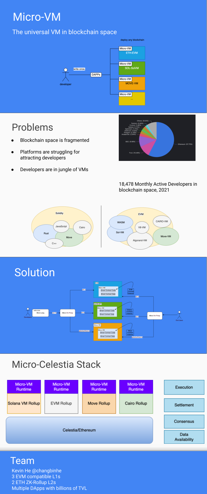

# Micro-VM
> The universal VM in blockchain space

Inspired by the vision of Celestia, suppose there are multiple Rollups in the space and the developers need to learn multiple platforms, so this project is to make their life easier by making a [jvm](https://en.wikipedia.org/wiki/Java_virtual_machine) or [flutter](https://flutter.dev/), to enable developers to write once, deploy to multiple platforms.

# Note
The project is still under spec drafting, anyone who is interested in this project, please contact freefacefly@gmail.com .

# One Page for MicroVM

