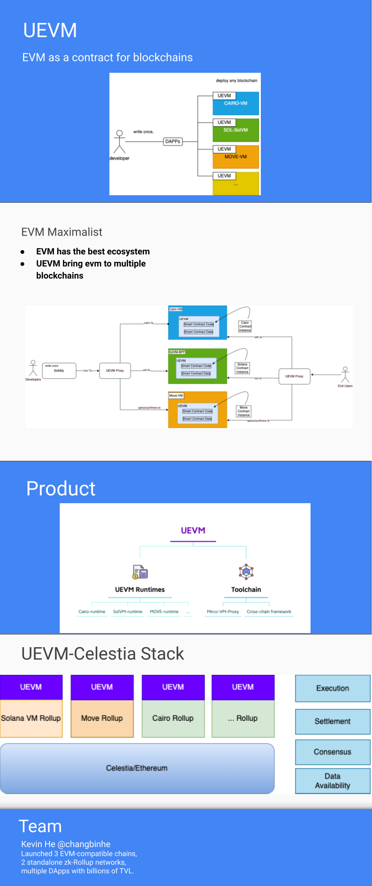

# UEVM
> EVM as a contract for blockchains

# Rational
Inspired by the vision of Celestia, suppose there are multiple Rollups in the space and the developers need to learn multiple platforms, so this project is to make their life easier by providing EVM as contract for blockchains, to enable developers to write once, deploy to multiple platforms.

# #1 Milestone

First milestone will be uevm-move for move blockchain, check out the [spec](./spec-uevm-move.md) and [code](./packages/uevm-move/) .

# One Page for UEVM

# Note
The project is still under spec drafting and early stage, anyone who is interested in this project, please contact freefacefly@gmail.com .
